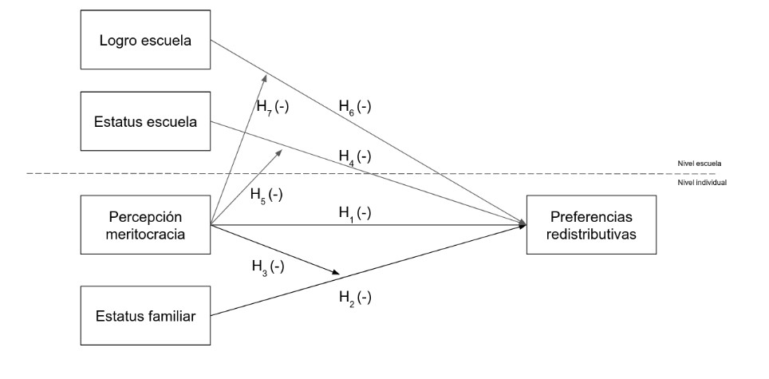
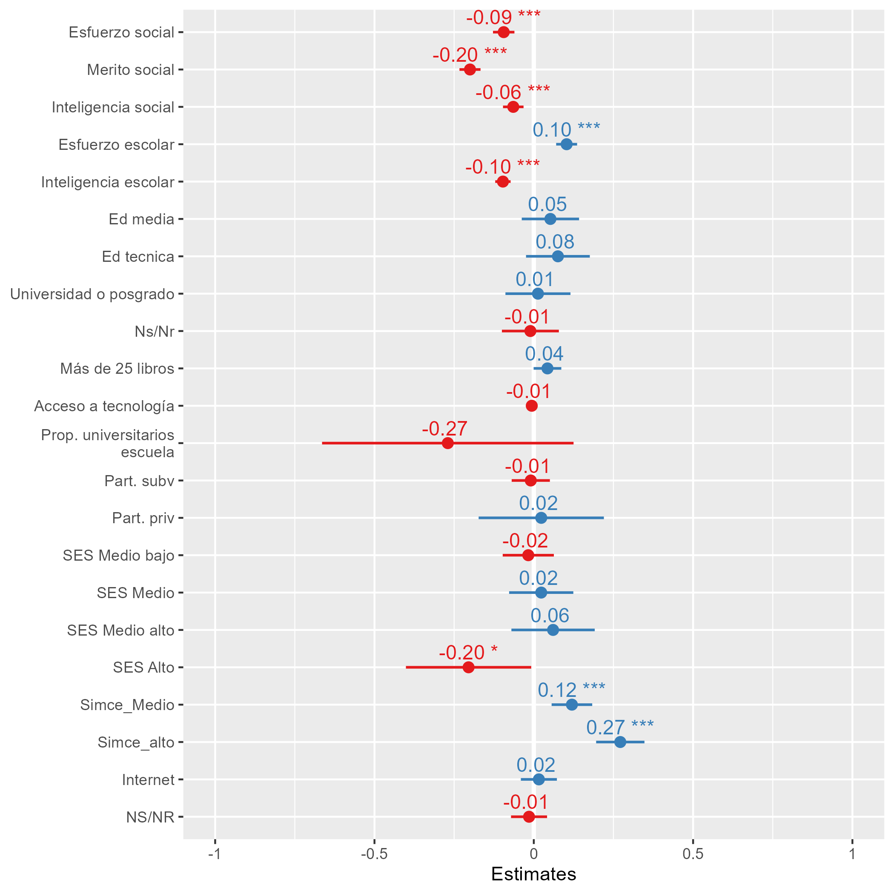
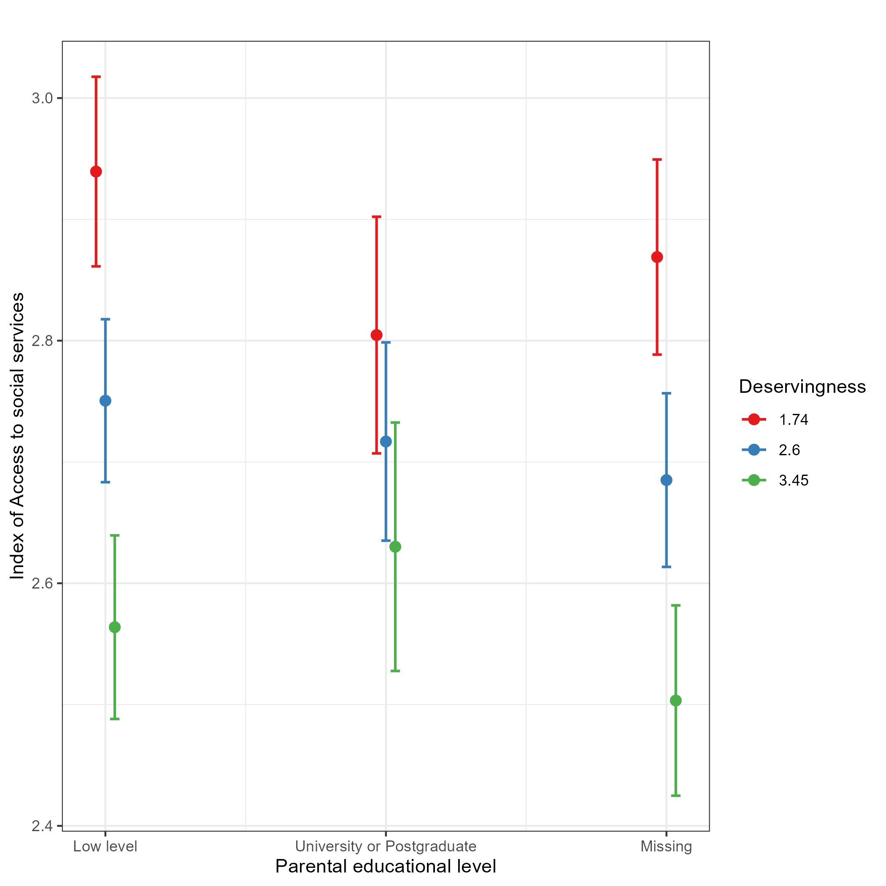
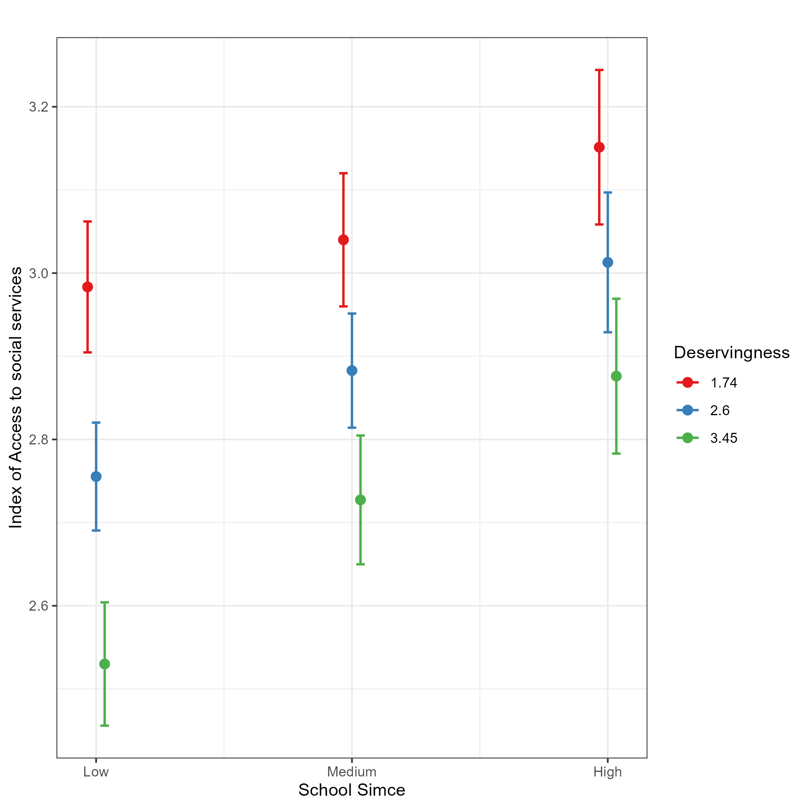

class: middle title-slide

```{r xaringanExtra, echo = FALSE}
  xaringanExtra::use_progress_bar(color = "red", location = c("top"))
```

.pull-left-narrow[

<br>
<br>
<br>
<br>
<br>
<br>
<br>


.small[.red[FONDECYT N°1210847 Meritocracia en la Escuela]
]
]


.pull-right-wide[
.right[

.content-box-red[
## Meritocracia, preferencias redistributivas y socialización política escolar

]

----
<br>
.espaciosimplelineas[
.medium[
Juan Carlos Castillo, Mauricio Salgado & Kevin Carrasco
] 
]


.small[Conferencia COES - 10 de Noviembre 2022]
]
]

---

layout: true
class: animated, fadeIn


---
class: middle

.pull-left-narrow[
# **PRICE**:
### Programa de Investigación en Ciudadanía Escolar
]

.pull-right-wide[


.right[
[ciudadania-escolar.cl/](https://ciudadania-escolar.cl)
]]


---
class: middle

.pull-left-narrow[
# **PRICE**:
### Programa de Investigación en Ciudadanía Escolar
]

.pull-right-wide[


.right[
Proyectos desde 2011 ]
]


---
.pull-left-narrow[
# **PRICE**:
### Programa de Investigación en Ciudadanía Escolar
]

.pull-right-wide[


]

---
class: inverse animated slideInRight

## .red[Meritocracia en la escuela, preferencias redistributivas, y socialización política escolar
]

.pull-right[
.large[
1. Introdución
2. Hipótesis
3. Metodología
4. Resultados
5. Discusión
]
]

---
class: inverse 

## .red[Meritocracia en la escuela, preferencias redistributivas, y socialización política escolar
]

.pull-right[
.large[
1. .yellow[Introdución]
2. Hipótesis
3. Metodología
4. Resultados
5. Discusión
]
]


---
# .black[Introducción]

.pull-left[
.content-box-gray[
## Preferencias redistributivas

  - Interés racional (homo economicus)
  
  - Factores culturales
  ]
  ]
  
--
.pull-right[
<br>
.content-box-green[
## Meritocracia

  - Esfuerzo y talento
  
  - Elementos normativos
  
  - Elementos perceptuales
]
]
---
class:inverse middle center

## .yellow[¿En qué medida la percepción de meritocracia en la etapa escolar se asocia a preferencias redistributivas?
]

---
# .black[Introducción]

----

.pull-left[
.content-box-purple[
## Familia

  - Estatus socioeconómico
  
  - Capital cultural

<br>

  ]
  ]

.pull-right[
.content-box-yellow[
## Escuela

- Percepción de meritocracia (escuela y sociedad)

- Orientación al logro

<br>

]

]

---
class: inverse animated slideInRight

## .red[Meritocracia en la escuela, preferencias redistributivas, y socialización política escolar
]

.pull-right[
.large[
1. Introdución
2. .yellow[Hipótesis]
3. Metodología
4. Resultados
5. Discusión
]
]

---
## Hipótesis

.center[]

---
class: inverse animated slideInRight

## .red[Meritocracia en la escuela, preferencias redistributivas, y socialización política escolar
]

.pull-right[
.large[
1. Introdución
2. Hipótesis
3. .yellow[Metodología]
4. Resultados
5. Discusión
]
]

---

## Primer estudio nacional de Formación Ciudadana 2017

.pull-left[
* Realizado por la Agencia de Calidad de Educación

* 3 bases de datos

* Problemas de documentación
]

.pull-right[
.right[
]
]

---
## Diseño de la investigación y preregistro de hipótesis


.pull-left[
.left[
]
]
.pull-right[

* Largo proceso de planificación

* Reestructurado varias veces

* Marco general de investigación; no se especifican ciertos análisis
]

.center[https://doi.org/10.17605/OSF.IO/UFSDV]

---
.espaciosimplelineas[
.medium[
## Variables dependientes

### **Preferencias redistributivas**

Índice de Acceso a servicios sociales:

* Es justo que en Chile las personas con mayores ingresos puedan tener mejores pensiones que las personas de ingresos más bajos.

* Es justo que en Chile las personas que puedan pagar tengan una mejor educación para sus hijos.

* Es justo que en Chile las personas con mayores ingresos puedan acceder a una mejor atención de salud que las personas con ingresos más bajos.

]
]
---
.espaciosimplelineas[
.medium[
## Variables dependientes

### **Preferencias redistributivas**

Apoyo a políticas públicas de redistribución

* El Gobierno de Chile debería hacer algo para reducir las diferencias de ingreso entre ricos y pobres
]
]
---
.espaciosimplelineas[
.medium[

## Variables independientes

### **Percepción de meritocracia**

.pull-left[
En la sociedad

* En Chile, las personas son recompensadas por sus esfuerzos.

* En Chile, las personas obtiene lo que merecen.

* En Chile, las personas son recompensadas por su inteligencia y habilidad.
]
]
]
--
.espaciosimplelineas[
.medium[
.pull-right[
En la escuela

* La inteligencia es importante para obtener buenas notas.

* El esfuerzo es importante para obtener buenas notas.
]

]
]

---

# Primeros resultados

---

.center.small[**Índice acceso a servicios sociales**]

.center[]


---

.center.small[**Apoyo a políticas públicas de redistribución**]


.center[]

---

.pull-left[
.center[
.tiny[Educación de los padres y Mérito]
]

.center[]
]
--
.pull-right[
.center[
.tiny[Logro simce y Mérito]
]
.center[]
]
---

(title slide)