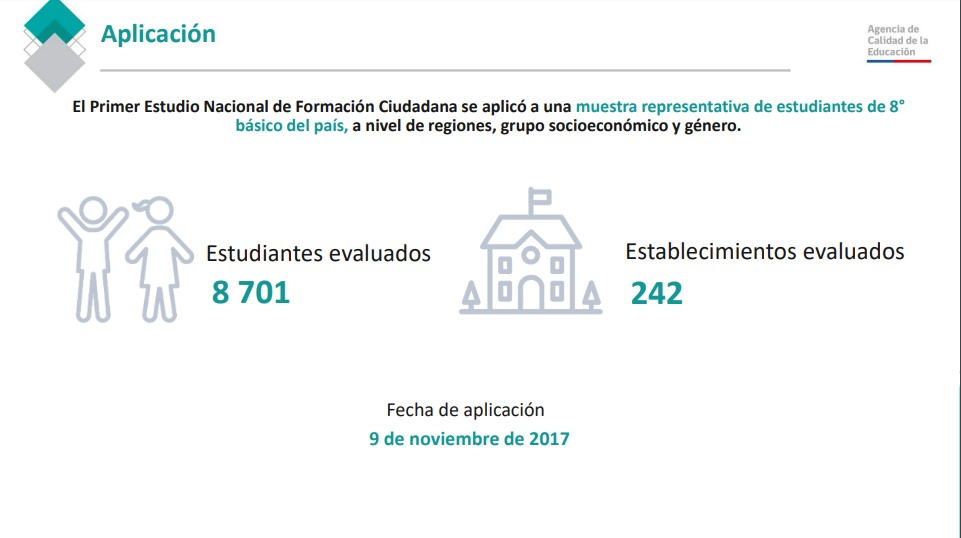
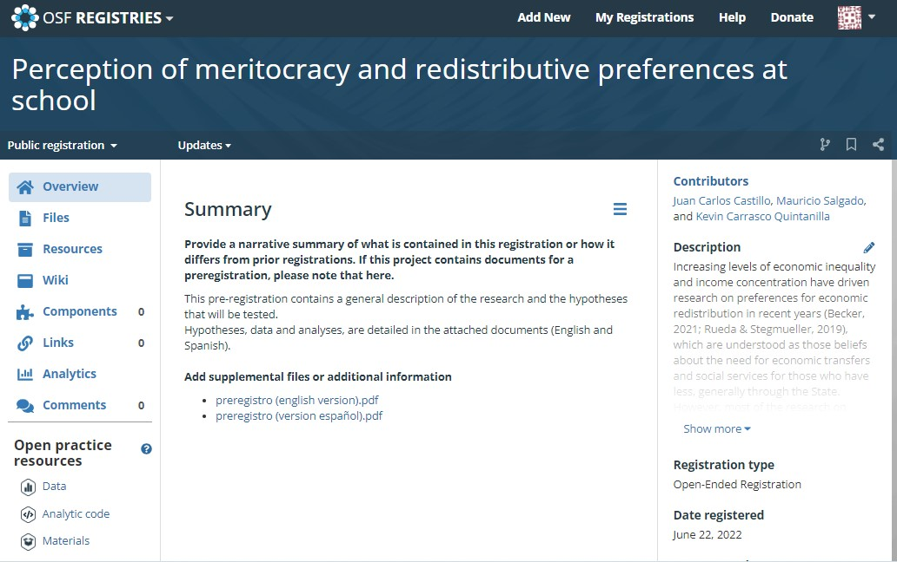

class: middle hide-logo title

```{r xaringanExtra, echo = FALSE}
  xaringanExtra::use_progress_bar(color = "red", location = c("top"))
```

.pull-left-narrow[
.espaciosimple[
.tiny[]
]
<br>
<br>
<br>


<br>

]


.pull-right-wide[
.right[

.content-box-gray[
## Meritocracia, preferencias redistributivas y socialización política escolar
### **Resultados preliminares**
]

----
.espaciosimplelineas[
.medium[
Juan Carlos Castillo, Mauricio Salgado & Kevin Carrasco

**FONDECYT N°1210847 Meritocracia en la escuela**

] 
]


.small[Martes 04 de octubre de 2022]

]
]

---
class: inverse

## Estructura de la presentación

* Primer estudio de Formación Ciudadana 2017

* Diseño de la investigación y preregistro de hipótesis

* Variables y métodos

* Modelo teórico

* Primeros resultados

---

## Primer estudio nacional de Formación Ciudadana 2017

.pull-left[
* Realizado por la Agencia de Calidad de Educación

* 3 bases de datos

* Problemas de documentación
]

.pull-right[
.right[
]
]

---
## Diseño de la investigación y preregistro de hipótesis


.pull-left[
.left[
]
]
.pull-right[

* Largo proceso de planificación

* Reestructurado varias veces

* Marco general de investigación; no se especifican ciertos análisis
]

.center[https://doi.org/10.17605/OSF.IO/UFSDV]

---
.espaciosimplelineas[
.medium[
## Variables dependientes

### **Preferencias redistributivas**

Índice de Acceso a servicios sociales:

* Es justo que en Chile las personas con mayores ingresos puedan tener mejores pensiones que las personas de ingresos más bajos.

* Es justo que en Chile las personas que puedan pagar tengan una mejor educación para sus hijos.

* Es justo que en Chile las personas con mayores ingresos puedan acceder a una mejor atención de salud que las personas con ingresos más bajos.

]
]
---
.espaciosimplelineas[
.medium[
## Variables dependientes

### **Preferencias redistributivas**

Apoyo a políticas públicas de redistribución

* El Gobierno de Chile debería hacer algo para reducir las diferencias de ingreso entre ricos y pobres
]
]
---
.espaciosimplelineas[
.medium[

## Variables independientes

### **Percepción de meritocracia**

.pull-left[
En la sociedad

* En Chile, las personas son recompensadas por sus esfuerzos.

* En Chile, las personas obtiene lo que merecen.

* En Chile, las personas son recompensadas por su inteligencia y habilidad.
]
]
]
--
.espaciosimplelineas[
.medium[
.pull-right[
En la escuela

* La inteligencia es importante para obtener buenas notas.

* El esfuerzo es importante para obtener buenas notas.
]

]
]

---
## Modelo teórico

.center[]

---

# Primeros resultados

---

.center.small[**Índice acceso a servicios sociales**]

.center[]


---

.center.small[**Apoyo a políticas públicas de redistribución**]


.center[]

---

.pull-left[
.center[
.tiny[Educación de los padres y Mérito]
]

.center[]
]
--
.pull-right[
.center[
.tiny[Logro simce y Mérito]
]
.center[]
]
---

.pull-left-narrow[
.espaciosimple[
.tiny[]
]
<br>
<br>
<br>


<br>

]


.pull-right-wide[
.right[

.content-box-gray[
## Meritocracia, preferencias redistributivas y socialización política escolar
### **Resultados preliminares**
]

----
.espaciosimplelineas[
.medium[
Juan Carlos Castillo, Mauricio Salgado & Kevin Carrasco

**FONDECYT N°1210847 Meritocracia en la escuela**

] 
]

.small[Martes 04 de octubre de 2022]

]
]
