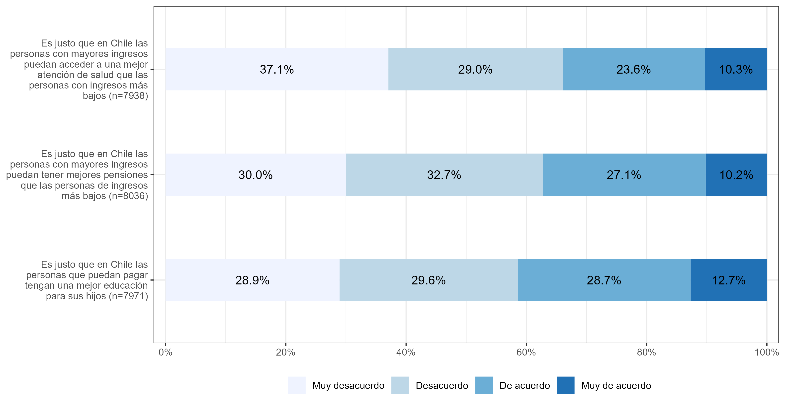

class: middle title-slide

```{r xaringanExtra, echo = FALSE}
  xaringanExtra::use_progress_bar(color = "red", location = c("top"))
```

.pull-left-narrow[

<br>
<br>
<br>
<br>
<br>
<br>
<br>


.small[.red[FONDECYT N°1210847 Meritocracia en la Escuela]
]
]


.pull-right-wide[
.right[

.content-box-red[
## Socialización de la Meritocracia en la escuela y la justificación de la desigualdad social

]

----
<br>
.espaciosimplelineas[
.medium[
Juan Carlos Castillo, Mauricio Salgado & Kevin Carrasco
] 
]


.small[26 de enero 2023]
]
]

---

layout: true
class: animated, fadeIn


---

class: inverse animated slideInRight

### .red[Socialización de la Meritocracia en la escuela y la justificación de la desigualdad social
]

.pull-right[
.large[
1. Introducción
2. Hipótesis
3. Metodología
4. Resultados
5. Discusión
]
]

---
class: inverse 

### .red[Socialización de la Meritocracia en la escuela y la justificación de la desigualdad social
]

.pull-right[
.large[
1. .yellow[Introducción]
2. Hipótesis
3. Metodología
4. Resultados
5. Discusión
]
]


---
# .black[Introducción]

.pull-left[
.content-box-gray[
## Justificación de la Desigualdad

  - Interés racional (homo economicus)
  
  - Factores culturales
  ]
  ]
  
--
.pull-right[
<br>
.content-box-green[
## Meritocracia

  - Esfuerzo y talento
  
  - Elementos normativos
  
  - Elementos perceptuales
]
]
---
class:inverse middle center

## .yellow[¿En qué medida la percepción de meritocracia en la etapa escolar se asocia a la justificación de la desigualdad?
]

---
# .black[Introducción]

----

.pull-left[
.content-box-purple[
## Familia

  - Estatus socioeconómico
  
  - Capital cultural

<br>

  ]
  ]

.pull-right[
.content-box-yellow[
## Escuela

- Percepción de meritocracia (escuela y sociedad)

- Orientación al logro

<br>

]

]

---
class: inverse animated slideInRight

### .red[Socialización de la Meritocracia en la escuela y la justificación de la desigualdad social
]

.pull-right[
.large[
1. Introdución
2. .yellow[Hipótesis]
3. Metodología
4. Resultados
5. Discusión
]
]

---
## Hipótesis

.center[]

.small[
* Preregistro: [https://doi.org/10.17605/OSF.IO/UFSDV](https://doi.org/10.17605/OSF.IO/UFSDV)
]
---
class: inverse animated slideInRight

### .red[Socialización de la Meritocracia en la escuela y la justificación de la desigualdad social
]

.pull-right[
.large[
1. Introdución
2. Hipótesis
3. .yellow[Metodología]
4. Resultados
5. Discusión
]
]

---
## Datos
----

.pull-left[
* Primer estudio nacional de Formación Ciudadana 2017

* Realizado por la Agencia de Calidad de Educación

* Estudiantes y apoderados


]

.pull-right[
.right[
]
]

---
.espaciosimplelineas[
.medium[
## Variables dependientes

.center[]
]
]
---
.espaciosimplelineas[
.medium[

## Variables independientes

.center[]
]
]

---

## Variables independientes
----
.pull-left[
.content-box-purple[
### Familia

* Nivel educacional de los apoderados

* Cantidad de libros en el hogar

* Acceso a tecnología

]
]

.pull-right[
.content-box-yellow[
### Escuela

* Proporción de apoderados con educación universitaria

* Dependencia adm.

* NSE

* Logro en prueba SIMCE

]
]

---
class: inverse animated slideInRight

### .red[Socialización de la Meritocracia en la escuela y la justificación de la desigualdad social
]

.pull-right[
.large[
1. Introdución
2. Hipótesis
3. Metodología
4. .yellow[Resultados]
5. Discusión
]
]
---

.pull-left-narrow[
<br>
### Acceso desigual a salud, pensiones y educación según ingresos
]

.pull-right-wide[
.center[]
]
---

.pull-left-narrow[
<br>
### Índice justificación de la desigualdad
]


.pull-right-wide[

.center[]
]
---

.pull-left-narrow[
<br>
### Índice justificación de la desigualdad: Interacciones
]

.pull-right-wide[
.center[]
]
---
class: inverse animated slideInRight

### .red[Socialización de la Meritocracia en la escuela y la justificación de la desigualdad social
]

.pull-right[
.large[
1. Introdución
2. Hipótesis
3. Metodología
4. Resultados
5. .yellow[Discusión]
]
]

---
# Discusión

- la percepción de una sociedad meritocrática está relacionada con la justificación de que quienes tienen más recursos también tengan más beneficios

- percepción de la meritocracia en la escuela: efectos mixtos

- los estudiantes que asisten a escuelas con mejores puntajes de rendimiento en promedio justifican menos la desigualdad.

- escuelas con alto SIMCE también mitigan el efecto positivo de meritocracia en la justificación de la desigualdad

---
class: roja middle

# ¡Muchas gracias!

.right[
.yellow[Más información en: 

[www.ciudadania-escolar.cl](https://ciudadania-escolar.cl/)
]]


---
class: middle title-slide


.pull-left-narrow[

<br>
<br>
<br>
<br>
<br>
<br>
<br>


.small[.red[FONDECYT N°1210847 Meritocracia en la Escuela]
]
]


.pull-right-wide[
.right[

.content-box-red[
## Socialización de la Meritocracia en la escuela y la justificación de la desigualdad social

]

----
<br>
.espaciosimplelineas[
.medium[
Juan Carlos Castillo, Mauricio Salgado & Kevin Carrasco
] 
]


.small[26 de Enero 2023]
]
]

