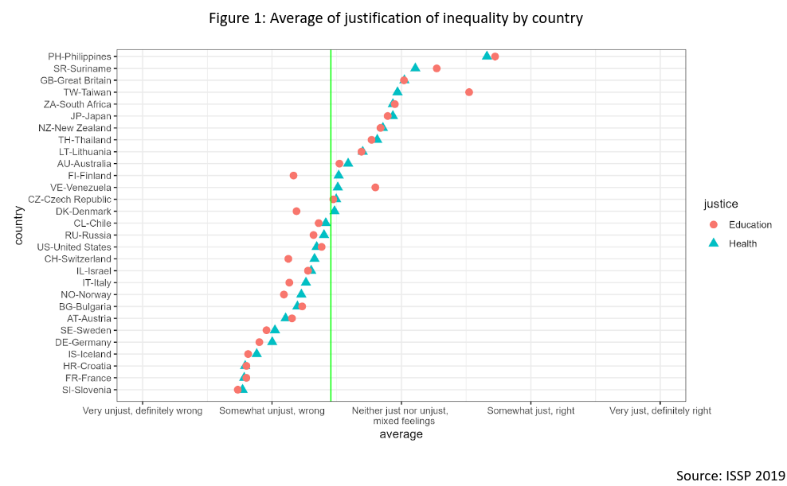
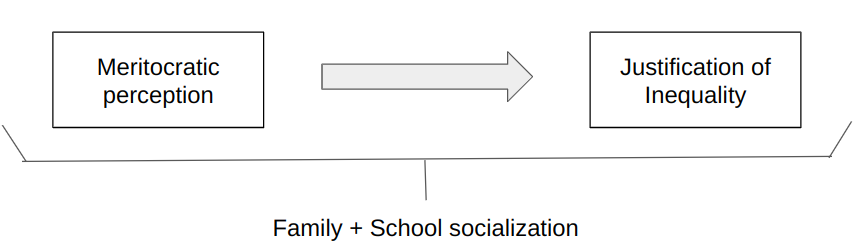
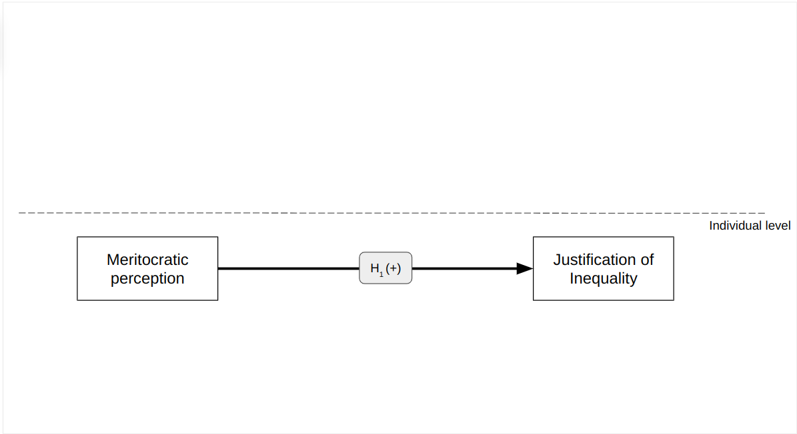
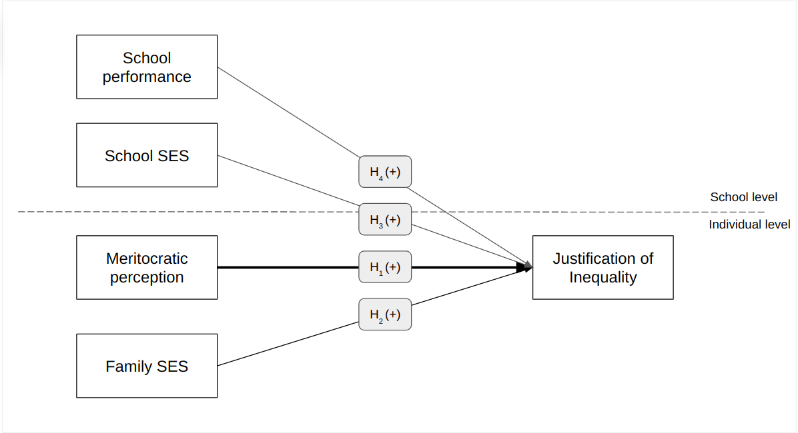
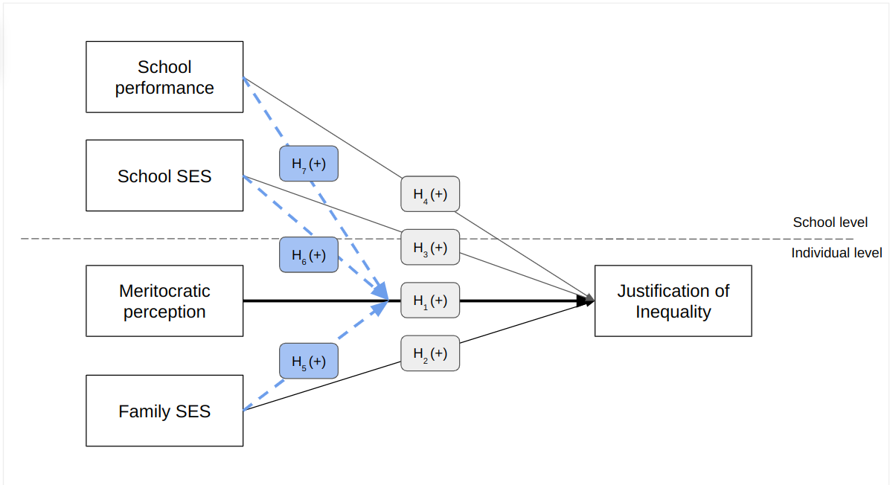
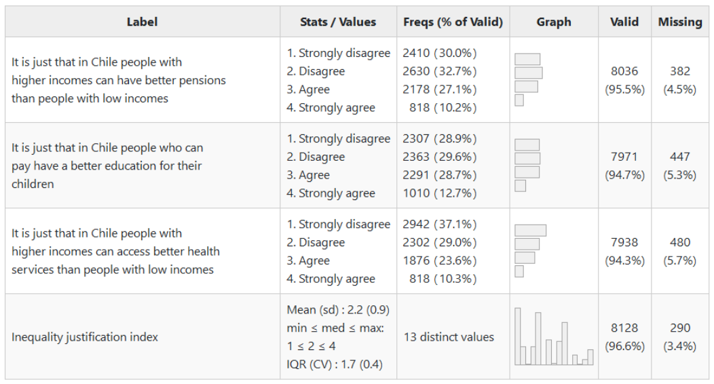
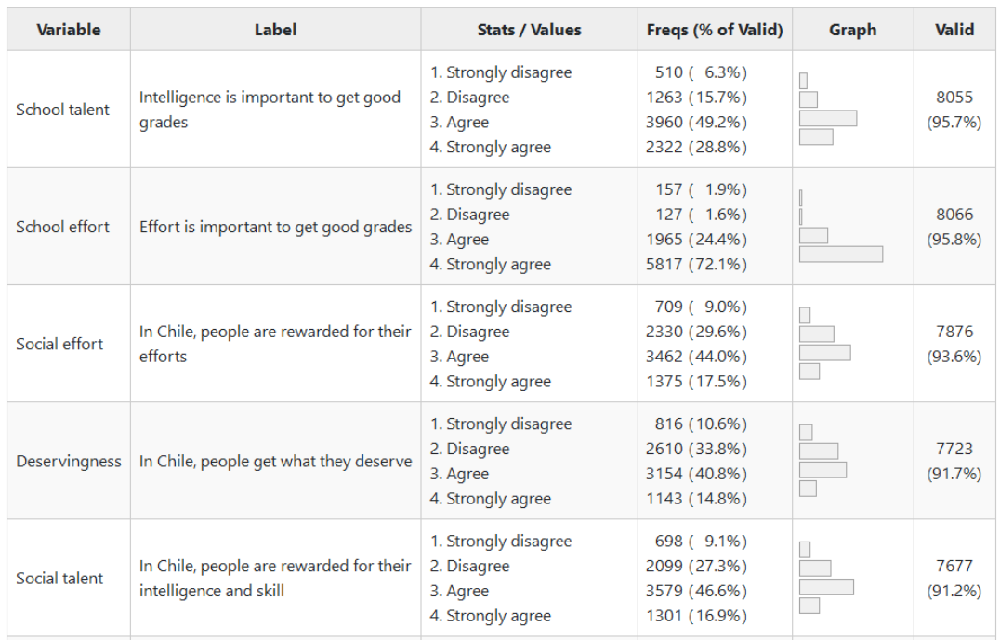

class: middle title-slide

```{r xaringanExtra, echo = FALSE}
  xaringanExtra::use_progress_bar(color = "red", location = c("top"))
```


```{r xaringan-tile-view, echo=FALSE}
xaringanExtra::use_tile_view()
```

.pull-left-narrow[

<br>
<br>
<br>
<br>
<br>
<br>
<br>


.small[.red[FONDECYT N°1210847 Meritocracia en la Escuela]
]
]


.pull-right-wide[
.right[

.content-box-red[
## The socialization of meritocracy at school and the justification of economic inequality

]

----


<br>

.medium[
<div style="line-height:150%;">
Juan Carlos Castillo, Mauricio Salgado,Kevin Carrasco, <br>
Camila Moyano & Nicolás Angelcos
</div>

.red[EFFORT Conference - Madrid, Universidad Carlos III]
]


.small[June 16th 2023]
]
]


???
This afternoon I am going to present you our study on justification of inequality and meritocracy at school, developed by our team together with M Salgado, Kevin ...

---

layout: true
class: animated, fadeIn


---
class: roja bottom

# Context & motivation

???

First of all, some words about context and motivation

---
#  ciudadania-escolar.cl 

<iframe
  src="https://padlet.com/julioiturrasanhueza/ciudadania-escolar-3nxkkwxjd1gm7tzw"
  title="iframe Example 1"
  width="400"
  height="500">
</iframe>


???
- This study is part of a larger research agenda and network focused on studying citizenship education, with several projects developed over the last ten years

-more information about this in our webpage ciudadania-escolar.cl

---

.pull-left-narrow[

]

.pull-right-wide[
.red[Meritocracy at school: Moral foundations of educational markets and implications for citizenship education] 

ANID/FONDECYT Grant 2021-2024

- First stage: 

  - qualitative study
  - analysis of secondary data
  
- Second stage

  - panel study
  - survey experiments


.small[
More information:
[jc-castillo.com/project/fondecyt-edumer/](https://jc-castillo.com/project/fondecyt-edumer/)


]
]

???
Currently, we are working in a 4-year project funded by our national agency of research (ANID) with focus on the moral foundations of educational markets and their implications for citizenship education.

In a first stage we have been working on a qualitative study (our researcher Camila Moyano will talk about this on friday) and also analysis of secondary data as this study

Now we are designing a panel study and survey experiments in schools in Chile

---
class: roja bottom

# This study

---
class: center



???
- Justification of inequality refers to the extent to which individuals are **willing to accept** different types of inequities in society. 

- Although this might sound **counterintuitive** (as inequality is generally conceived as something unjust), from studies as ISSP we know that there is actually large variation among countries (and also at individual level) in the justification of inequalities in areas of education and health.

- There are **different ways** to conceptualize and operationalize inequalities justification. In this study we are interested in to what extent it is considered just that those with larger incomes can have better education, health and pensions


---
<br>

.pull-left[
.content-box-gray[
### Justification of inequality

  - Rational interests (homo economicus)
  
  - Cultural factors and policy feedback effects
  
  - Chile, marketization & neoliberal reforms
  ]
  ]
  
--

.pull-right[

.content-box-green[
### Meritocracy

  - Effort and talent (Young, 1958)
  
  - Normative and perceptual elements (Duru-Bellat & Tenret, 2012;Castillo et al, 2019)
  
  - School context (Batruch, 2023; Wiederkehr, 2015; Resh & Sabbagh; Lampert, 2012)
]
]


???

How to explain that people are willing to justify inequality? 

- a first basic explanation would be that those with a better position in society are benefited and probably willing to justify more inequality) 

- but empirical evidences from the 80s in this field tell us consistently that there are other factors as education, culture, institutions and social context that certainly play a role. 

- Taking this into account, our research group is interested in how in a country with deep neoliberal reforms and commodification in areas as education, pensions and health could impact the way in which inequalities are justified

- And here we connect with the concept of meritocracy. Usually associated to distribution based on individual effort and talent, meritocracy has been largely challenged as it sidelines the role of initial opportunities, as the family status or the typ of education received, 

- when studying meritocracy we consider two main aspects: the way in which meritocracy is perceived to function (for instance, whether efforts are rewarded in society) as well as normative preferences (whether efforts **should** be rewarded in society)

- there are some studies that previously have dealt with meritocracy at school, for instance the way in which grades in school are perceived to be distributed in a meritocratic way.


---
class:middle center




???
Our research question deals with the connection between perceived meritocracy and justification of inequality.

- a first research question would be: are those perceiving more meritocracy willing to justify more inequality? 

- Our second interest is on the development of this type of justification, this is, to what extent the school and family context is related to inequality justification and meritocratic perceptions.


---
## Hypoteses  
.center[

]

???
we have three sets of hypotheses
- the central one links meritocracy to the justification of inequality, meaning that those who perceive that meritocracy functions in society would be more willing to justify inequalities


---
## Hypoteses  
.center[

]

???
- then we introduce some socialization variables, arguing in a rational sense that context with a higher economic and social capital would be associated to more inequality justification

---
## Hypoteses  
.center[

]

???
- finally we introduce some interaction terms in order to explore whether the link betwenn meritocracy and inequality justificatio is moderated by socialization variables

---
class: roja bottom
# Methods

---
class: middle

# Data
.pull-left-narrow[

----]

.pull-right-wide[
* First National Study of Citizenship Education 2017

* National Agency for Educational Quality, Chile

* 8,701 8th grade students, 242 schools
]


---
## Dependent Variables: Justification of inequality

.center[]

---
.espaciosimplelineas[
.medium[

## Indepentent variables: meritocracy

.center[]
]
]

---

### Independent variables: socialization
----
.pull-left[

### Family

* Parents' educational level

* Books at home

* Technology access
]

.pull-right[
### School

* Rate of parents with university education

* School administration

* Socio economic level

* Average school achievement SIMCE test
]

---
class: roja bottom right

# Results 


---
.pull-left-narrow[
####**Justification of inequality and perception of social meritocracy**]
.pull-right-wide[
]


???


---
class: center
Multilevel ordinal logit models - Jusification of Inequality

---

.pull-left-narrow[
<br>
###Interactions
.red[Inequality justification (index) by deservingness x school achievement]
]

.pull-right-wide[
.center[]
]

???

we observe a negative interaction, where the association between meritocracy and justification is lower for those with better results in the national achievement test SIMCE.

---
class: roja

.pull-left[
### **.orange[Conclusions]**

- Perception of meritocracy **.yellow[in society]**: positively related with inequality justification

- perception of meritocracy **.yellow[at school**]: mixed links with inequality justification

- .yellow[socialization] and role of school achievement: education enlightement effect (?)]

--

.pull-right[
### **.orange[Future]**
- survey experiments

- 3 wave panel study

- refine measures of school meritocracy and socialization

- collaboration :)
]

---
class: roja middle

# ¡Muchas gracias!


.right[
Presentation available online [.yellow[here: bit.ly/edumer-effort2023 ]](https://bit.ly/edumer-effort2023)


Github Repo: [.yellow[ github.com/educacion-meritocracia/meritocracia-escuela-agencia/]](https://github.com/educacion-meritocracia/meritocracia-escuela-agencia)
.white[More information about this and other projects: 

[.yellow[www.ciudadania-escolar.cl]](https://ciudadania-escolar.cl/)
]
]
---
class: middle title-slide


.pull-left-narrow[

<br>
<br>
<br>
<br>
<br>
<br>
<br>


.small[.red[FONDECYT N°1210847 Meritocracia en la Escuela]
]
]


.pull-right-wide[
.right[

.content-box-red[
## The socialization of meritocracy at school and the justification of economic inequality

]

----


<br>

.medium[
<div style="line-height:150%;">
Juan Carlos Castillo, Mauricio Salgado, Kevin Carrasco, <br>
Camila Moyano & Nicolás Angelcos
</div>

.red[EFFORT Conference - Madrid, Universidad Carlos III]
]


.small[June 16th 2023]
]
]

