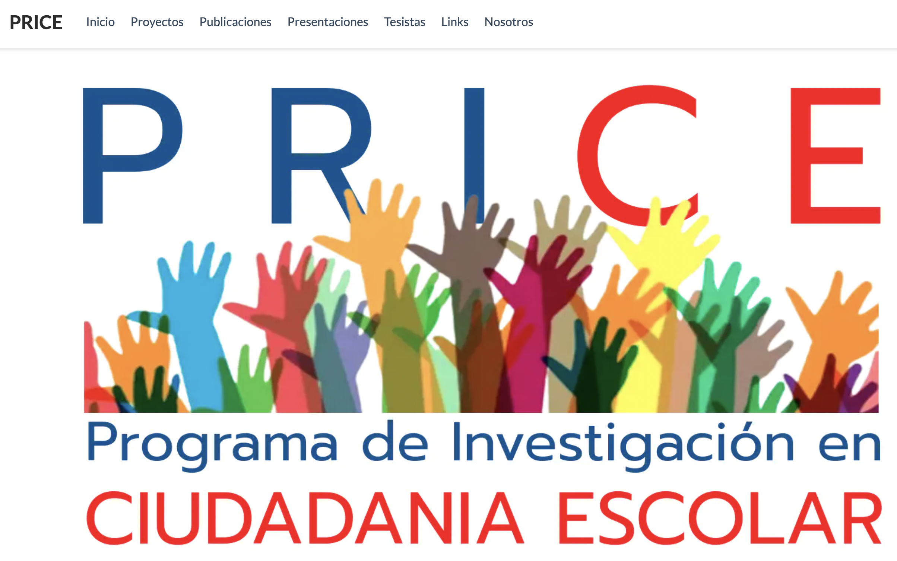

class: middle title-slide

```{r xaringanExtra, echo = FALSE}
  xaringanExtra::use_progress_bar(color = "red", location = c("top"))
```

.pull-left-narrow[

<br>
<br>
<br>
<br>
<br>
<br>
<br>


.small[.red[FONDECYT N°1210847 Meritocracia en la Escuela]
]
]


.pull-right-wide[
.right[

.content-box-red[
## The socialization of meritocracy at school and the justification of economic inequality

]

----


<br>

.medium[
<div style="line-height:150%;">
Juan Carlos Castillo, Mauricio Salgado,Kevin Carrasco, <br>
Camila Moyano & Nicolás Angelcos
</div>

.red[EFFORT Conference - Madrid, Universidad Carlos III]
]


.small[June 16th 2023]
]
]

---

layout: true
class: animated, fadeIn


---
class: roja bottom

# Context & motivation


---
#  ciudadania-escolar.cl 

<iframe
  src="https://padlet.com/julioiturrasanhueza/ciudadania-escolar-3nxkkwxjd1gm7tzw"
  title="iframe Example 1"
  width="400"
  height="500">
</iframe>


---

.pull-left-narrow[

]

.pull-right-wide[
.red[Meritocracy at school: Moral foundations of educational markets and implications for citizenship education] 

ANID/FONDECYT Grant 2021-2024

- First stage: 

  - qualitative study
  - analysis of secondary data
  
- Second stage

  - panel study
  - survey experiments


.small[
More information:
[jc-castillo.com/project/fondecyt-edumer/](https://jc-castillo.com/project/fondecyt-edumer/)


]
]

---
class: roja bottom

# This study

---
class: center


---
<br>

.pull-left[
.content-box-gray[
### Justification of inequality

  - Rational interests (homo economicus)
  
  - Cultural factors and policy feedback effects
  
  - Chile, marketization & neoliberal reforms
  ]
  ]
  
--

.pull-right[

.content-box-green[
### Meritocracy

  - Effort and talent (Young, 1948)
  
  - Normative and perceptual elements (Duru-Bellat & Tenret, 2012;Castillo et al, 2019)
  
  - School context (Batruch, 2023; Wiederkehr, 2015; Resh & Sabbagh; Lampert, )
]
]
---
class:middle center


---
.content-box-red[
## Meritocracy & targets
]
<br>
.pull-left[

.content-box-gray[
 ### Meritocratic dimensions

  - Preferences (what ought to be)

  - Perceptions (what is)
]]

.pull-right[
.content-box-gray[
### Targets

  - Society
  
  - School
  
  - others ...
]]
---
## Hypoteses  
.center[

]

---
## Hypoteses  
.center[

]
---
## Hypoteses  
.center[

]
---
class: roja bottom
# Methods

---
class: middle

# Data
.pull-left-narrow[

----]

.pull-right-wide[
* First National Study of Citizenship Education 2017

* National Agency for Educational Quality, Chile

* 8,701 8th grade students, 242 schools
]


---
## Dependent Variables: Justification of inequality

.center[]

---
.espaciosimplelineas[
.medium[

## Indepentent variables: meritocracy

.center[]
]
]

---

## Independent variables: socialization
----
.pull-left[

### Family

* Parents' educational level

* Books at home

* Technology access
]

.pull-right[
### School

* Rate of parents with university education

* School administration

* Socio economic level

* Average school achievement SIMCE test
]

---
class: roja bottom right

# Results 


---
####**Justification of inequality and perception of social meritocracy**


---
class: center

---

.pull-left-narrow[
<br>
###Interactions
.red[Inequality justification (index) by deservingness x school achievement]
]

.pull-right-wide[
.center[]
]

---
class: roja

.pull-left[
### **.orange[Conclusions]**

- Perception of meritocracy **.yellow[in society]**: positively related with inequality justification

- perception of meritocracy **.yellow[at school**]: mixed links with inequality justification

- .yellow[socialization]: role of school achievement]

--

.pull-right[
### **.orange[Future]**
- survey experiments

- 3 wave panel study

- refine measures of school meritocracy and socialization
]

---
class: roja middle

# ¡Muchas gracias!

.right[
.yellow[More information: 

[.yellow[www.ciudadania-escolar.cl]](https://ciudadania-escolar.cl/)
]]

---
class: middle title-slide


.pull-left-narrow[

<br>
<br>
<br>
<br>
<br>
<br>
<br>


.small[.red[FONDECYT N°1210847 Meritocracia en la Escuela]
]
]


.pull-right-wide[
.right[

.content-box-red[
## The socialization of meritocracy at school and the justification of economic inequality

]

----


<br>

.medium[
<div style="line-height:150%;">
Juan Carlos Castillo, Mauricio Salgado, Kevin Carrasco, <br>
Camila Moyano & Nicolás Angelcos
</div>

.red[EFFORT Conference - Madrid, Universidad Carlos III]
]


.small[June 16th 2023]
]
]

