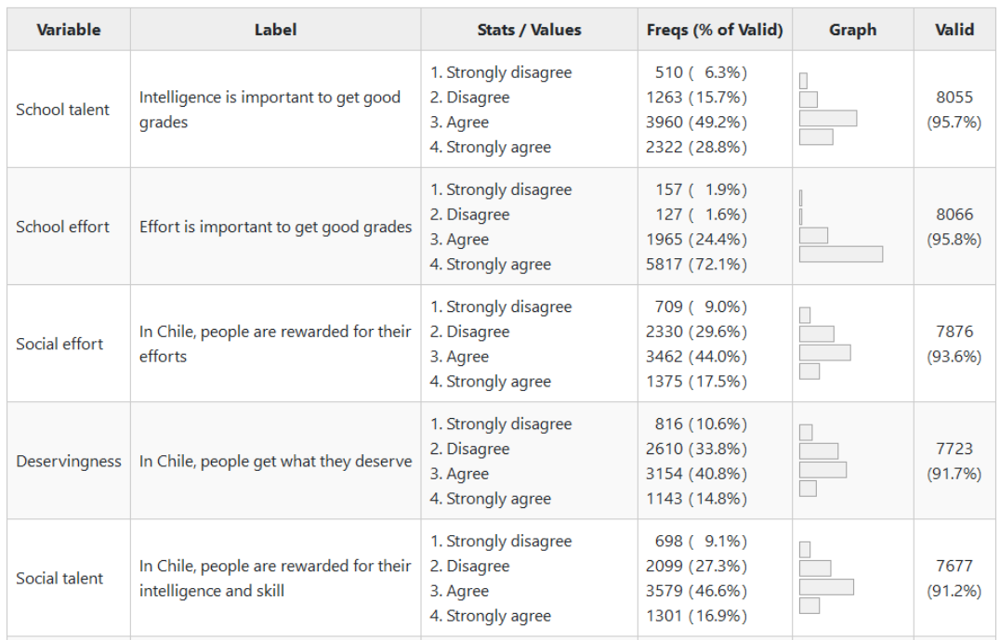

class: middle title-slide

```{r xaringanExtra, echo = FALSE}
  xaringanExtra::use_progress_bar(color = "red", location = c("top"))
```


```{r xaringan-tile-view, echo=FALSE}
xaringanExtra::use_tile_view()
```

.pull-left-narrow[


.small[.red[FONDECYT N°1210847 Meritocracia en la Escuela]

<br>
<br>


<div style="line-height:150%;">
Conferencia DEMOSAL
<br>Buenos Aires, 
17 de Agosto 2023
</div>
]]


.pull-right-wide[
.right[

.content-box-red[
## Socialización de la meritocracia en la escuela y justificación de la desigualdad económica

]

----


.medium[
<div style="line-height:150%;">
Juan Carlos Castillo & Kevin Carrasco * 
<br> Mauricio Salgado, Camila Moyano & Nicolás Angelcos<br>
</div>
]
<br>
.small[
<div style="line-height:150%;">
*Departmento de Sociología, Universidad de Chile - COES
</div>
Contacto: [juancastillov@uchile.cl](juancastillov@uchile.cl) - [jc-castillo.com](https://jc-castillo.com)

]
]
]


???
This afternoon I am going to present you our study on justification of inequality and meritocracy at school, developed by our team together with M Salgado, Kevin ...

---

layout: true
class: animated, fadeIn


---
class: roja bottom

# Contexto y motivación


---

.pull-left-narrow[

]

.pull-right-wide[
.red[Meritocracia en la escuela: Fundamentos morales de los mercados educativos e implicaciones para la educación ciudadana] 

ANID/FONDECYT 2021-2024

- Primera etapa:

  - Estudio cualitativo
  - análisis de datos secundarios
  
- Segunda etapa

  - panel de estudio
  - experimentos de encuestas


.small[
Más información:
[jc-castillo.com/project/fondecyt-edumer/](https://jc-castillo.com/project/fondecyt-edumer/)


]
]

???
Currently, we are working in a 4-year project funded by our national agency of research (ANID) with focus on the moral foundations of educational markets and their implications for citizenship education.

In a first stage we have been working on a qualitative study (our researcher Camila Moyano will talk about this on friday) and also analysis of secondary data as this study

Now we are designing a panel study and survey experiments in schools in Chile

---
class: roja bottom

# Este estudio

---
class: center


???
- Justification of inequality refers to the extent to which individuals are **willing to accept** different types of inequities in society. 

- Although this might sound **counterintuitive** (as inequality is generally conceived as something unjust), from studies as ISSP we know that there is actually large variation among countries (and also at individual level) in the justification of inequalities in areas of education and health.

- There are **different ways** to conceptualize and operationalize inequalities justification. In this study we are interested in to what extent it is considered just that those with larger incomes can have better education, health and pensions


---
<br>

.pull-left[
.content-box-gray[
### Justificación de la desigualdad

  - Intereses racionales (homo economicus)
  
  - Factores culturales y efectos de retroalimentación de políticas (feedback effects).
  
  - Chile, mercantilización y reformas neoliberales
  ]
  ]
  
--

.pull-right[

.content-box-green[
### Meritocracia

  - Esfuerzo y talento (Young, 1958)
  
  - Elementos normativos y perceptivos (Duru-Bellat & Tenret, 2012;Castillo et al, 2019)
  
  - Contexto escolar (Batruch, 2023; Wiederkehr, 2015; Resh & Sabbagh; Lampert, 2012)
]
]


???

How to explain that people are willing to justify inequality? 

- a first basic explanation would be that those with a better position in society are benefited and probably willing to justify more inequality) 

- but empirical evidences from the 80s in this field tell us consistently that there are other factors as education, culture, institutions and social context that certainly play a role. 

- Taking this into account, our research group is interested in how in a country with deep neoliberal reforms and commodification in areas as education, pensions and health could impact the way in which inequalities are justified

- And here we connect with the concept of meritocracy. Usually associated to distribution based on individual effort and talent, meritocracy has been largely challenged as it sidelines the role of initial opportunities, as the family status or the typ of education received, 

- when studying meritocracy we consider two main aspects: the way in which meritocracy is perceived to function (for instance, whether efforts are rewarded in society) as well as normative preferences (whether efforts **should** be rewarded in society)

- there are some studies that previously have dealt with meritocracy at school, for instance the way in which grades in school are perceived to be distributed in a meritocratic way.


---
class:middle center


???
Our research question deals with the connection between perceived meritocracy and justification of inequality.

- a first research question would be: are those perceiving more meritocracy willing to justify more inequality? 

- Our second interest is on the development of this type of justification, this is, to what extent the school and family context is related to inequality justification and meritocratic perceptions.


---
## Hipótesis  
.center[

]

???
we have three sets of hypotheses
- the central one links meritocracy to the justification of inequality, meaning that those who perceive that meritocracy functions in society would be more willing to justify inequalities


---
## Hipótesis  
.center[

]

???
- then we introduce some socialization variables, arguing in a rational sense that context with a higher economic and social capital would be associated to more inequality justification

---
## Hipótesis  
.center[

]

???
- finally we introduce some interaction terms in order to explore whether the link betwenn meritocracy and inequality justificatio is moderated by socialization variables

---
class: roja bottom
# Métodos

---
class: middle

# Datos
.pull-left-narrow[

----]

.pull-right-wide[
* Primer Estudio Nacional de Educación Ciudadana 2017

* Agencia Nacional para la Calidad Educativa, Chile

* 8,701 estudiantes de 8° grado, 242 escuelas
]


---
## Variables Dependientes: Justificación de la desigualdad

.center[]

---
.espaciosimplelineas[
.medium[

## Variables independientes: meritocracia

.center[]
]
]

---

### Variables independientes: socialización
----
.pull-left[

### Familia

* Nivel educativo de los padres

* Libros en casa

* Acceso a la tecnología
]

--

.pull-right[
### Escuela

* Tasa de padres con estudios universitarios

* Administración escolar

* Nivel socioeconómico

* Rendimiento escolar promedio prueba SIMCE
]

---
class: roja bottom right

# Resultados 


---
.pull-left-narrow[
####**Justificación de la desigualdad y percepción de la meritocracia social**]
.pull-right-wide[
]


???


---
class: center
Modelos logit ordinales multinivel - Justificación de la desigualdad

---

.pull-left-narrow[
<br>
###Interacciones
.red[Justificación de la desigualdad (índice) por merecimiento x logro escolar]
]

.pull-right-wide[
.center[]
]

???

we observe a negative interaction, where the association between meritocracy and justification is lower for those with better results in the national achievement test SIMCE.

---
class: roja

.pull-left[
### **.orange[Conclusiones]**

- Percepción de meritocracia **.yellow[en la sociedad]**: positivamente relacionada con la justificación de la desigualdad

- percepción de meritocracia **.yellow[en la escuela**]: vínculos mixtos con justificación de la desigualdad

- .yellow[socialización] y papel del logro escolar: efecto de iluminación educativa (?)]

--

.pull-right[
### **.orange[A futuro]**
- experimentos de encuestas

- Estudio de panel de 3 ondas

- refinar las medidas de meritocracia escolar y socialización

- colaboración :)
]

---
class: roja middle

# ¡Muchas gracias!

<br>


.right[
Github Repo: [.yellow[ github.com/educacion-meritocracia/meritocracia-escuela-agencia/]](https://github.com/educacion-meritocracia/meritocracia-escuela-agencia)
.white[Más información sobre este y otros proyectos: 

[.yellow[www.ciudadania-escolar.cl]](https://ciudadania-escolar.cl/)
]
]
---
class: middle title-slide


.pull-left-narrow[


.small[.red[FONDECYT N°1210847 Meritocracia en la Escuela]

<br>
<br>
<br>


Agosto 17 2023
]]


.pull-right-wide[
.right[

.content-box-red[
## Socialización de la meritocracia en la escuela y justificación de la desigualdad económica

]

----


.medium[
<div style="line-height:150%;">
Juan Carlos Castillo* 
<br> Mauricio Salgado, Kevin Carrasco, <br>
Camila Moyano & Nicolás Angelcos
</div>
]
<br>
.small[
<div style="line-height:150%;">
*Departmento de Sociología, Universidad de Chile
</div>
[juancastillov@uchile.cl](juancastillov@uchile.cl) - [jc-castillo.com](https://jc-castillo.com)

]
]
].pull-left-narrow[


.small[.red[FONDECYT N°1210847 Meritocracia en la Escuela]

<br>
<br>


<div style="line-height:150%;">
Conferencia DEMOSAL
<br>Buenos Aires, 
17 de Agosto 2023
</div>
]]


.pull-right-wide[
.right[

.content-box-red[
## Socialización de la meritocracia en la escuela y justificación de la desigualdad económica

]

----


.medium[
<div style="line-height:150%;">
Juan Carlos Castillo & Kevin Carrasco* 
<br> Mauricio Salgado, Camila Moyano & Nicolás Angelcos<br>
</div>
]
<br>
.small[
<div style="line-height:150%;">
*Departmento de Sociología, Universidad de Chile - COES
</div>
Contacto: [juancastillov@uchile.cl](juancastillov@uchile.cl) - [jc-castillo.com](https://jc-castillo.com)

]
]
]
